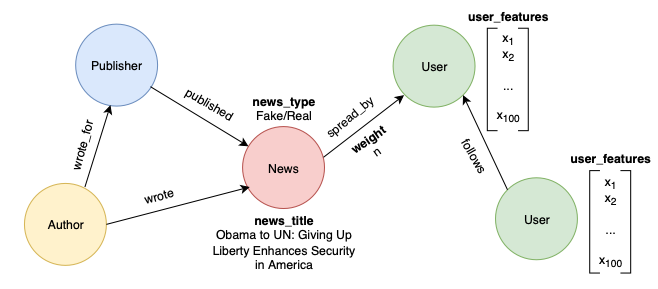
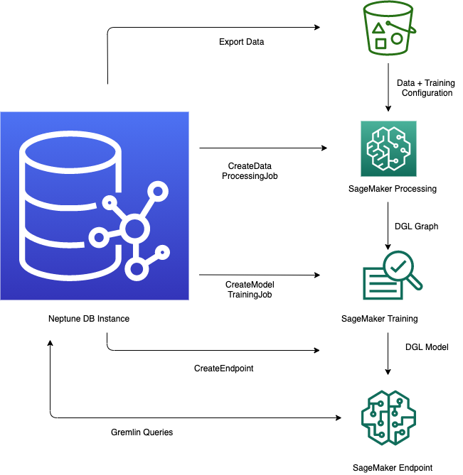

# Detecting Social Media Fake News with Amazon Neptune ML

The spread of misinformation and fake news on social media has posed a major challenge to the well-being of individuals and societies. It is imperative that we develop robust and automated solutions for early detection of fake news on social media. Traditional approaches rely purely on the news content to mark an information piece as real or fake news. However, the social context in which the news is published and spread can provide additional insights into the nature of fake news on social media and hence improve the predictive capabilities of fake news detection tools.  Here we demonstrate how Amazon Neptune ML can be leveraged to detect fake news based on the content and social context of the news spread on social media.

## Dataset

We use the BuzzFeed dataset from the 2018 version of [FakeNewsNet](https://github.com/KaiDMML/FakeNewsNet) in this work. The BuzzFeed dataset is made of a sample of news articles shared on Facebook from 9 news agencies over one week leading up to the 2016 U.S. election. Every post and the corresponding news article have been fact-checked by BuzzFeed journalists. Table below summarizes key statistics about the dataset:

|                    |         |   |   |                   |        |
|--------------------|--------:|---|---|-------------------|-------:|
| # of Users:        |  15,257 |   |   | # of Engagements: | 25,240 |
| # of Authors:      |     126 |   |   | # of News:        |    182 |
| # of Publishers:   |      28 |   |   | # of Fake News:   |     91 |
| # of Social Links: | 634,750 |   |   | # of Real News:   |     91 |

We process the raw data from FakeNewsNet repository; and convert them into comma-separated-values (CSV) format for vertices (nodes) and edges in a heterogeneous property graph that can be readily loaded into an Amazon Neptune database with Apache TinkerPop Gremlin. The constructed property graph is composed of 4 vertex types and 5 edge types, as demonstrated in the schematic below, which together describe the social context in which each news is published and spread. 

## Graph Machine Learning with Neptune ML

Graph Machine Learning with Amazon Neptune ML involves five main steps:

1. **Data Export and Configuration** – The data-export step uses the Neptune-Export service to export data from Neptune into Amazon S3 in CSV format. A configuration file named training-data-configuration.json is automatically generated which specifies how the exported data can be loaded into a trainable graph.

2. **Data Preprocessing** – The exported dataset is preprocessed using standard techniques to prepare it for model training. Feature normalization can be performed for numeric data, and text features can be encoded using word2vec. At the end of this step, a DGL (Deep Graph library) graph is generated from the exported dataset for the model training step. This step is implemented using a SageMaker processing job, and the resulting data is stored in an Amazon S3 location that you have specified.

3. **Model Training** – This step trains the machine learning model that will be used for predictions. Model training is done in two stages: The 1st stage uses a SageMaker processing job to generate a model training strategy configuration set that specifies what type of model and model hyperparameter ranges will be used for the model training. The 2nd stage uses a SageMaker model tuning job to try different hyperparameter configurations and select the training job that produced the best-performing model. The tuning job runs a pre-specified number of model training job trials on the processed data. At the end of this stage, the trained model parameters of the best training job are used to generate model artifacts for inference.

4. **Creating Inference Endpoint in Amazon SageMaker** – The inference endpoint is a SageMaker endpoint instance that is launched with the model artifacts produced by the best training job. The endpoint is able to accept incoming requests from the graph database and return the model predictions for inputs in the requests. 

5. **Querying the ML Model using Gremlin** – You can use extensions to the Gremlin query language to query predictions from the inference endpoint.

## Running Code
1. As an initial step, run through `1-create-graph-dataset.ipynb` notebook to generate the graph dataset.
2. Use the `2-load-graph-dataset.ipynb` notebook to load the graph dataset to an Amazon Neptune cluster.
3. Use the `3-detect-fake-news-neptune-ml.ipynb` notebook to run through steps 1 to 5 above of graph machine learning with Amazon Neptune ML an interactive way.
4. Use the `4-inductive-inference.ipynb` notebook to go through an example of real-time inductive inference with Amazon Neptune ML.

If needed, you can run the `for-reference_clear-neptune-database.ipynb` notebook to clear the Amazon Neptune database. This can be helpful if you run the sample and then want to create your own data in Amazon Neptune. 

Note: Use this [QuickStart CloudFormation template](https://docs.aws.amazon.com/neptune/latest/userguide/machine-learning-quick-start.html) to quickly spin up a `graph-notebook`, an associted Neptune cluster, and set up all the configurations needed to work with Neptune ML in a `graph-notebook`. To run the `create-graph-dataset.ipynb` notebook select a NotebookInstanceType of `ml.c5.9xlarge` to ensure you have enough memory to load the `UserFeature.mat` file.

## Security

See [CONTRIBUTING](CONTRIBUTING.md#security-issue-notifications) for more information.

## License

This library is licensed under the MIT-0 License. See the LICENSE file.

